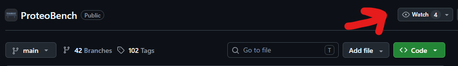

(faq)=
# Frequently asked questions

For "what is ProteoBench" and "who is it for", see the [Overview](index.md). This page covers
more specific questions.

## How do I use ProteoBench?

Depending on your goal:

- **Looking for a workflow recommendation?** Open the [module](../modules/index.rst) that matches
  your data type in the web app, and compare which workflow performs best on the metric that
  matters to you (e.g. quantification accuracy).
- **Want to compare your own workflow?** See [Your First Submission](../your-first-submission/index.md)
  for the full walkthrough.
- **Want to run things locally instead of through the web app?** ProteoBench is available as a
  [PyPI package](https://pypi.org/project/proteobench/); see
  [Using ProteoBench locally](../contributing/local-usage.md) for a runnable example notebook.

## My upload fails

Check if you have the correct file uploaded.

## Do I need to run my workflow on a predefined dataset?

Yes. Every module defines a fixed benchmark dataset, and all submissions to that module must use
it. This keeps comparisons fair — differences between submitted results then reflect differences in
data analysis, not differences in sample composition, instrument setup, or data quality.

If your use case needs a different dataset, [propose a new module](../contributing/propose-a-module.md) —
ProteoBench is modular by design specifically so it can grow with new use cases.

## Do I need to use the same workflow parameters as other users?

No. Modules suggest parameters to give you a comparable starting point, but you're free to submit
results from your own parameter choices. Every public submission's parameters are collected and
downloadable, so others can interpret performance differences in light of software version,
settings, and search database. If you're deliberately testing one specific parameter, mention that
in the comments field when you submit.

## Do I need a specific FASTA database?

Where the choice of database affects the benchmark outcome, the module page specifies the required
or recommended FASTA. Using the same database keeps submissions comparable.

## Can I benchmark commercial software?

Yes, as long as its output can be parsed directly or converted into one of the module's supported
formats (see that module's "Tool-specific setup" section, or use the
[custom format](../your-first-submission/index.md#if-your-tool-isnt-supported) if there's no
parser yet).

## What should I do if my tool isn't directly supported?

Use the custom tabular format described on the module page — see
[Your First Submission](../your-first-submission/index.md#if-your-tool-isnt-supported) for what
that involves. If you'd like native support instead,
[open an issue](https://github.com/Proteobench/ProteoBench/issues) or
[propose a new parser](../contributing/adding-a-module).

## Why are submissions reviewed before becoming public?

Manual review is a quality check: it catches incomplete submissions, wrong file types, a mismatched
module, missing metadata, or results that can't be meaningfully compared to what's already public.

## Does ProteoBench run my workflow automatically?

No — ProteoBench evaluates the output files you upload, it doesn't execute your workflow for you.
You download the benchmark data, run it through your own software or pipeline locally, and upload
the resulting files. This is what lets ProteoBench support commercial software, in-house pipelines,
and tools still under development.

## Where do I find the input data for a module?

Every module page links directly to its raw MS files, search database (where relevant), and any
example outputs. Some datasets are also mirrored on public repositories such as
[ProteomeXchange](https://www.proteomexchange.org/). If you can't find what you need,
[contact us](mailto:proteobench@eubic-ms.org).

## What is epsilon?

Epsilon is the accuracy metric most quantification modules use when the expected abundance ratios
between conditions are known. For a given precursor, it's the difference between the observed and
expected log2 fold change between conditions A and B — a value near zero means the workflow
recovered the expected ratio accurately.

Read epsilon together with the other metrics on the same plot: a workflow that quantifies many
precursors isn't necessarily the better choice if its epsilon is high.

## Does ProteoBench normalize the data or impute missing values?

No, not for the current modules. Normalization, missing-value handling, transfer steps, protein
inference, and quantification strategy are all treated as part of the workflow being benchmarked —
report them in your submission's parameter file. Where ProteoBench itself does perform some
processing, the relevant module page says so explicitly.

## How do I interpret differences between benchmark runs?

Differences can come from many places: feature detection, spectral library generation,
identification scoring, FDR control, match-between-runs, normalization, missing-value handling, and
software defaults. Treat results as workflow-level comparisons, and check both the software version
and the submitted parameters before drawing conclusions.

## Does ProteoBench validate FDR independently?

Where appropriate datasets exist, yes — see the entrapment-based modules (e.g.
[DIA Ion Entrapment - Astral](../modules/dia/entrapment-dia-astral.md)), which spike in peptides
that cannot be legitimately identified to estimate the true false discovery proportion independent
of what the search engine reports.

## How should I read the main plot on a module page?

As decision support, not a ranking. A tool that does well on one module, dataset, or metric may not
be the best fit for a different instrument, acquisition method, or question. Before drawing a
conclusion, check the module and dataset, the software version, the submitted parameters (e.g. the
target FDR), the exact metric definition, and the sensitivity/accuracy trade-off — and consider
whether the benchmarked workflow resembles your own intended use case.

## How can I follow ProteoBench's development?

- [GitHub Discussions](https://github.com/Proteobench/ProteoBench/discussions) — the preferred
  place for technical discussion, module proposals, and parser development (needs a GitHub account).
- "Watch" the [ProteoBench repository](https://github.com/Proteobench/ProteoBench) for email
  updates on issues, discussions, and releases, or watch an individual
  [results repository](https://github.com/Proteobench) for a specific module.
  
- No GitHub account? Use the [web app](https://proteobench.cubimed.rub.de/) and
  [docs](https://proteobench.readthedocs.io/en/stable/) directly, or join the ProteoBench channel
  on the [EuBIC-MS Slack](https://eubic-ms.org/).
- Follow [ProteoBench on LinkedIn](https://www.linkedin.com/company/proteobench) for regular
  updates.

## How can I contribute?

Submitting your own workflow's results is the most common contribution — see
[Your First Submission](../your-first-submission/index.md). Beyond that, you can report issues,
improve the documentation, propose a new module, contribute a parser for an unsupported tool, or
join the discussion. See [Contributing](../contributing/index.md) for the code/module side of
things.
