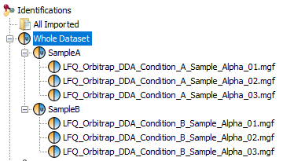

# DDA quantification - precursor ions

This module compares the sensitivity and quantification accuracy for data acquired with data-dependent acquisition (DDA) on a Q Exactive HF-X Orbitrap (Thermo Fisher).
Users can load their data and inspect the results privately. They can also make their outputs public by providing the associated parameter file and submitting the benchmark run to ProteoBench. By doing so, their workflow output will be stored alongside all other benchmark runs in ProteoBench and will be accessible to the entire community.

**This module is not designed to compare later-stages post-processing of quantitative data such as missing value replacement, and we advise users to publically upload data without replacement of missing values and without manual filtering.**  

We think that this module is more suited to evaluate the impact of (non exhaustive list):
- search engine identification
- peak picking
- match between run
- low-level ion signal normalisation

Other modules will be more suited to explore further post-pocessing steps. 

## Data set

A subset of the Q Exactive HF-X Orbitrap (Thermo Fisher) data dependent acquisition (DDA) data described by [Van Puyvelde et al., 2022](https://www.nature.com/articles/s41597-022-01216-6) was used as a benchmark dataset. Here, only the first biological replicate series (named “alpha”) was used, encompassing three technical replicates of two different conditions (referred to as “A” and “B”). The samples are a mixture of commercial peptide digest standards of the following species: Escherichia coli (P/N:186003196, Waters Corporation), Yeast (P/N: V7461, Promega) and Human (P/N: V6951, Promega), with logarithmic fold changes (log2FCs) of 0, −1 and 2 for respectively Human, Yeast and E.coli. 
Please refer to the original publication for the full description of sample preparation and data acquisition parameters ([Van Puyvelde et al., 2022](https://www.nature.com/articles/s41597-022-01216-6)). 

The files can be downloaded from the proteomeXchange repository [PXD028735](https://www.ebi.ac.uk/pride/archive/projects/PXD028735), make sure that you download the following raw files:

- [LFQ_Orbitrap_DDA_Condition_A_Sample_Alpha_01.raw](https://ftp.pride.ebi.ac.uk/pride/data/archive/2022/02/PXD028735/LFQ_Orbitrap_DDA_Condition_A_Sample_Alpha_01.raw)
- [LFQ_Orbitrap_DDA_Condition_A_Sample_Alpha_02.raw](https://ftp.pride.ebi.ac.uk/pride/data/archive/2022/02/PXD028735/LFQ_Orbitrap_DDA_Condition_A_Sample_Alpha_02.raw)
- [LFQ_Orbitrap_DDA_Condition_A_Sample_Alpha_03.raw](https://ftp.pride.ebi.ac.uk/pride/data/archive/2022/02/PXD028735/LFQ_Orbitrap_DDA_Condition_A_Sample_Alpha_03.raw)
- [LFQ_Orbitrap_DDA_Condition_B_Sample_Alpha_01.raw](https://ftp.pride.ebi.ac.uk/pride/data/archive/2022/02/PXD028735/LFQ_Orbitrap_DDA_Condition_B_Sample_Alpha_01.raw)
- [LFQ_Orbitrap_DDA_Condition_B_Sample_Alpha_02.raw](https://ftp.pride.ebi.ac.uk/pride/data/archive/2022/02/PXD028735/LFQ_Orbitrap_DDA_Condition_B_Sample_Alpha_02.raw)
- [LFQ_Orbitrap_DDA_Condition_B_Sample_Alpha_03.raw](https://ftp.pride.ebi.ac.uk/pride/data/archive/2022/02/PXD028735/LFQ_Orbitrap_DDA_Condition_B_Sample_Alpha_03.raw)

Alternatively, you can download them from the ProteoBench server here: [proteobench.cubimed.rub.de/datasets/raw_files/DDA/](https://proteobench.cubimed.rub.de/datasets/raw_files/DDA/)

**It is imperative not to rename the files once downloaded!**

Download the zipped FASTA file here: [ProteoBenchFASTA_MixedSpecies_HYE.zip](https://proteobench.cubimed.rub.de/datasets/fasta/ProteoBenchFASTA_MixedSpecies_HYE.zip).
The fasta file provided for this module contains the three species
present in the samples **and contaminant proteins**
([Frankenfield et al., JPR](https://pubs.acs.org/doi/10.1021/acs.jproteome.2c00145))

## Metric calculation

For each precursor ion (modified sequence + charge), we calculate the sum of signal per raw file. Contaminant sequences flagged with the prefix "Cont_" in the fasta file are removed, as well as the peptide ions that match proteins from several species and the peptide ions that are not quantified in any raw file. When applicable, "zeroes" are replaced by NAs and missing values are ignored.
Then we log2-transform the values, and calculate the mean signal per condition, with the standard deviation and coefficient of variation (CV). For each precursor ion, we calculate the difference between the mean(log2) in A and B, and compare it to its expected value (Human: 0, _E. coli_: -2, and Yeast: 1). The difference between measured and expected mean(log2) is called "epsilon".
The total number of unique precursor ions is reported on the vertical axis, and the mean or median absolute epsilon is reported on the horizontal axis. More detailed description of how the data are handled before metrics calculation may be found in the tool-specific paragraphs below. 

## How to use

Click [here](https://proteobench.cubimed.rub.de/Quant_LFQ_DDA_ion) if you want to submit your results or when you want to explore the DDA quantification module.

### Input data for private visualisation of your benchmark run(s)

The module is flexible in terms of what workflow the participants can run. However, to ensure a fair comparison of the different processing tools, we suggest using the parameters listed in Table 1.

**Table 1. Suggested parameters for module 2**
|Parameter|Value|
|---------|-----|
|Maximum number of missed cleavages|2|
|PSM FDR|0.01|
|Endopeptidase|Trypsin/P|
|Fixed modifications|Carbamidomethylation (C)|
|Variable modifications|Oxidation (M), Acetyl (Protein N-term)|
|Precursor mass tolerance|10 ppm|
|Fragment mass tolerance|0.02 Da|
|Minimum peptide length|7 residues|

### Submit your run for public usage

When you have successfully uploaded and visualized a benchmark run, we strongly encourage you to add the result to the online repository. This way, your run will be available to the entire community and can be compared to all other uploaded benchmark runs. By doing so, your workflow outputs, parameters and calculated metrics will be stored and publicly available. 

To submit your run for public usage, you need to upload the parameter file associated to your run in the field `Meta data for searches`. Currently, we accept outputs from MaxQuant, FragPipe, Proline Studio, AlphaPept, PEAKS and i2MassChroQ (see below for more tool-specific details). Please fill the `Comments for submission` if needed, and confirm that the metadata is correct (corresponds to the benchmark run) before checking the button `I confirm that the metadata is correct`. Then the button
`I really want to upload it` will appear to trigger the submission.

After upload, you will get a link to a Github pull request associated with your data. Please copy it and save it. With this link, you can get the unique identifier of your run (for example `ProlineStudio__20240106_141919`), and follow the advancement of your submission and add comments to communicate with the ProteoBench maintainers. If everything looks good, your submission will be reviewed and accepted (it will take a few working days). Then, your benchmark run will be added to the public runs of this module and plotted alongside all other benchmark runs in the figure. 

## Important Tool-specific settings
Table 2 provides an overview of the required input files for public submission. More detailed instructions are provided for each individual tool in the following section.

**Table 2. Overview of input files required for metric caluclation and public submission**
|Tool|Input file|Parameter File|
|---------|-----|-|
|AlphaPept|result_peptides.tsv|results.yaml|
|FragPipe|combined_ion.tsv|fragpipe.workflow|
|i2MassChroQ|_export.tsv|Project parameters.tsv|
|MaxQuant|evidence.txt|mqpar.xml|
|Proline Studio|<result file>.xlsx|<result file>.xlsx|
|Sage|lfq.tsv|results.json|
|PEAKS|lfq_features.csv|parameters.txt|

### AlphaPept (legacy tool\*)

To generate data compatible with ProteoBench, you can:
1. Load folder that contains the data files.
2. Define parameters 
-> For Match Between runs, please select “Match”
3. The input files for ProteoBench are "result_peptides.tsv" (peptide identification) and "results.yaml" (parameter file)

Once uploaded to ProteoBench:
In the "result_peptides.tsv", the following columns are considered:

- "shortname" to get the raw file name and know what samples the results comes from
- "protein" to get protein accessions and species
- "sequence" to get the modified sequences
- "charge" to get the charge of the precursor
- "decoy" to identify decoy matches ("true")
- "ms1_int_sum_apex_dn" to get the intensity values

\* AlphaPept has been labelled "legacy tool" since it has not been developped for more than a year. It may thus underperform compared to the most recent versions of other tools.

### FragPipe

To generate data compatible with ProteoBench, you can:
1. Select the LFQ-MBR workflow (using only 1 enzyme).
2. Following import of raw files, assign experiments "by File Name" right above the list of raw files.
3. **Make sure contaminants are not added when you add decoys to the database**. 
4. Upload “combined_ion.tsv” in order for Proteobench to calculate the precursor ratios. For public submission, please provide the parameter file “fragpipe.workflow”  that correspond to your search.

Once uploaded to ProteoBench:
In the "combined_ion.tsv", we consider that decoys are already removed, and the following columns are considered:

- "Modified Sequence" to get the modified sequences
- "Protein" to get protein accessions and species. In FragPipe output files, the protein identifiers matching a given precursor are in two separate columns: "Proteins" and "Mapped Proteins". So we concatenate these two fields to have the protein groups.
- "Charge" to get the charge of the precursor

### i2MassChroQ

A ProteoBench-compatible format is available in i2MassChroQ through the button "ProteoBench export". After running the identification step, you can select "MassChroQ" via the File menu for quantification. The results can then be loaded into MCQR, which also includes the ProteoBench export functionality. The export generates a tab-delimited file containing one row per quantified precursor for metric calculation ("proteobench_export.tsv"; column headers are: "rawfile", "sequence", "ProForma", "charge", "proteins" and "area"); and a parameter file for public submission ("Project parameters.tsv"). Like with the other tools, the protein identifiers should be in the format "sp|P49327|FAS_HUMAN".
Link to the i2MassChroQ documentation [here](http://pappso.inrae.fr/bioinfo/i2masschroq/documentation/html/). In the outputs of i2MassChroQ, we consider that decoys are already removed.
#### Specific information for searches with X!Tandem
Among the default parameters of X!Tandem, "quick acetyl" and "quick pyrolidone" seach for the variable modifications N-ter acetylation and pyrolidone. Please turn these off if you don't want to include such modifications in your search. 

### MaxQuant

By default, MaxQuant uses a contaminants-only fasta file that is located in the software folder (“contaminant.txt”). However, the fasta file provided for this module already contains a set of curated contaminant sequences. Therefore, in the MaxQuant settings (Global parameters > Sequences), **UNTICK the “Include contaminants” box**. 
When uploading the raw files, press the "No Fractions" button to set up the experiment names as follows: "A_Sample_Alpha_01", "A_Sample_Alpha_02", "A_Sample_Alpha_03", "B_Sample_Alpha_01", "B_Sample_Alpha_02", "B_Sample_Alpha_03". 

For this module, use the "evidence.txt" output in the "txt" folder of MaxQuant search outputs. For public submission, please upload the "mqpar.xml" file associated with your search.

Once uploaded to ProteoBench:
In the "evidence.txt", we consider that decoys are already removed, and the following columns are considered:

- "Modified sequence" to get the modified sequences
- "Proteins" to get protein accessions and species. 
- "Raw file" to get the sample of origin
- "Charge" to get the charge of the precursor

#### Troubleshooting: 
##### Fasta header parsing
The field "Proteins" in **the "evidence.txt" table should report proteins in the format "sp|O75822|EIF3J_HUMAN" (and separated with ";" in the case of protein groups)**. 
In the recent versions of MaxQuant, the default settings work perfectly (`Identifier rule = >([^ ]*)`; `Description rule = >(.*)`).
Some older versions of MaxQuant do not provide the option to change fasta header parsing. These are not compatible with ProteoBench.

### Proline Studio 

Make sure that the peaklists are named with the same prefix as raw files. To do so in ProlineStudio, use peaklist names as sample names (manually or with automatic renaming option).

The columns with the quantification values that ProteoBench will retrieve in the outputs will have the following format "abundance_LFQ_Orbitrap_DDA_Condition_A_Sample_Alpha_01.mgf". 
For this module, use the excel exports. Make sure that the `Quantified peptide ions` tab contains the columns `samesets_accessions` and `subsets_accessions`. The accessions in these two fields are combined to determine what species a peptide sequence matches to.
The `Quantified peptide ions` tab reports the precursor ion quantities (retrieved from XICs). Shared peptides ions between multiple ProteinSets are duplicated. This redundancy is removed by combining the protein identification from all rows of a given precursor ion before metric calculation.
In the outputs of ProlineStudio, we consider that decoys are already removed.

For public submission, you can upload the same excel export, just make sure to have the tabs `Search settings and infos`, `Import and filters`, `Quant config`. For local usage and public submission, we strongly recommend to use the following [template.json](../../files_provided_to_users/quant_lfq_ion_DDA/ProlineStudio/template.json) to make sure that all the tabs and columns needed are exported to be correctly parsed. Make sure that no personal information is stored in the excel file before making it public. The version of ProlineStudio is only exported in the parameters from version 2.3. 

### MSAngel (work in progress..)

MSAngel allows to build piplenes for bottom-up MS analysis with a choice of search engines, validation strategy and the Proline quantification. 
More information can be found [here](https://www.profiproteomics.fr/ms-angel/)

### PEAKS
When starting a new project and selecting the .RAW files, there is no need to modify the sample names given by PEAKS. Just make sure that the sample names correspond to:
- LFQ_Orbitrap_DDA_Condition_A_Sample_Alpha_01
- LFQ_Orbitrap_DDA_Condition_A_Sample_Alpha_02
- LFQ_Orbitrap_DDA_Condition_A_Sample_Alpha_03
- LFQ_Orbitrap_DDA_Condition_B_Sample_Alpha_01
- LFQ_Orbitrap_DDA_Condition_B_Sample_Alpha_02
- LFQ_Orbitrap_DDA_Condition_B_Sample_Alpha_03

Make sure to set Enzyme as trypsin,  Instrument as Orbitrap (Orbi-Orbi), Fragment as HCD and Acquisition as DDA.
In workflow section use the PEAKS Q (de novo assisted search quantification) option. Set the different parameters in "Data refine" and "DB search". In the tab "Quantification" use the "Label Free" option, followed by either adding all samples individually or grouping samples according to their respective condition. In the "Report" tab, make sure both Peptide FDR and Protein Group FDR are set to 1%. 
Once the workflow has run succesfully, make sure to check the "All Search Parameters" and the "Feature Vector CSV" from the Label Free Quantification Exports in the "Export" tab. 

### Sage

To generate data compatible with ProteoBench, you can:
1. Convert .raw files into .mzML using MSConvert or ThermoRawFileParser **(do not change the file names)**
2. Run sage using a .json file
3. Upload "lfq.tsv" in order for Proteobench to calculate the precursor ratios, combined with the search parameter file "results.json".

Once uploaded to ProteoBench:
In the "lfq.tsv", the following columns are considered:

- "proteins" to get protein accessions and species
- "peptide" to get the modified sequences
- "charge" to get the charge of the precursor

### Quantms (work in progress)

When you run the DDA workflow in QuantMS, you can upload the precursors from the process
`ProteomicsLFQ` (using OpenMS) with the name `<project-name>.sdrf_openms_design_msstats_in.csv` 
to ProteoBench. Several version with PTMs still have to be tested.

The parameters needed for public submission can be parsed based on the `versions.yml` and 
parameter json `params_<timestamp>.json` produced by the `pipeline-info` step.

### Custom format

If you do not use a tool that is compatible with ProteoBench, you can upload a tab-delimited table format containing the following columns:

- Sequence: peptide sequence without the modification(s)
- Proteins: column containing the protein identifiers. These should be separated by ";", and contain the species flag (for example "_YEAST").
- Charge: Charge state of measured peptide precursor ions
- Modified sequence: column containing the sequences and the localised modifications in the [ProForma standard](https://www.psidev.info/proforma) format. 
- LFQ_Orbitrap_DDA_Condition_A_Sample_Alpha_01: Quantitative column sample 1
- LFQ_Orbitrap_DDA_Condition_A_Sample_Alpha_02: Quantitative column sample 2
- LFQ_Orbitrap_DDA_Condition_A_Sample_Alpha_03: Quantitative column sample 3
- LFQ_Orbitrap_DDA_Condition_B_Sample_Alpha_01: Quantitative column sample 4
- LFQ_Orbitrap_DDA_Condition_B_Sample_Alpha_02: Quantitative column sample 5
- LFQ_Orbitrap_DDA_Condition_B_Sample_Alpha_03: Quantitative column sample 6

the table must not contain non-validated precursor ions. If you have any issue, contact us [here](mailto:proteobench@eubic-ms.org?subject=ProteoBench_query).

## toml file description

Each software tool produces specific output files formats. We made ``.toml`` files that describe where to find the information needed in each type of input. These can be found in `proteobench/io/parsing/io_parse_settings`:

- **[mapper]**
mapping between the headers in the input file (left-hand side) and the header of the intermediate file generated by ProteoBench. If more parsing is required before metrics calculation, this part can contain mapping between intermediatec column names and the name in the intermediate file. This is the case for Proline Studio where protein accessions are reported in two independent columns that need to be combined. This should be commented in the toml.

  - "Raw file" = field that contains the raw file identifiers. **If the field "Raw file" is present, the table is parsed is a long format, otherwise it is parsed as wide format.**
 
  - "Reverse" = field that indicates if the precursor is identified as decoy/reverse. **If the field "Reverse" is present, we will filter out the values of this column equal to the decoy flag (see [general]).**

  - "Sequence" = peptide sequence without modification(s)
 
  - "Modified sequence" = peptide sequence with localised modifications, ideally in the ProForma format.
 
  - "Charge" = precursor charge.
 
  - "Proteins" = field containing the protein identifiers. These should be separated by ";", and contain the species flag (for example "_YEAST"). *Curently, there is an exception for FragPipe's .toml where we combine two columns, and protein IDs are seperated by "," (see the FragPipe section).*
 
  - "Intensity" = field containing the intensities utilised to calculate the module metrics. Used for long-format input.

- **[condition_mapper]**
mapping between the headers of the quantification values in the input file (left-hand side) and the condition (Condition A and Condition B). 

- **[run_mapper]**
mapping between the headers of the quantification values in the input file (left-hand side) and the samples (condition + replicate) in the intermediate file.

- **[species_mapper]**
suffix corresponding to the species in the input table (left-hand side), and corresponding species (right-hand side) for ratio calculation. 

- **[general]**
contaminant and decoy flags used for filtering out precursor ions matched to decoy or contaminant sequences. The contaminant flag in this module should be "Cont_" to correspond to the contaminants as labelled in the provided fasta file. The decoy flag is only used to filter out rows that do not pass the validation step but are reported in the table.

- **[modifications_parser]**
information necessary for parsing the modification and their localisation when the input table contains a columns with modified sequences. When the input contains a column with stripped sequences and a column with the localised modification, this part is not needed. 

  - "parse_column" = "Modified Sequence" / Indicates the name of the column that should be parsed (i.e. that contains the sequence and localised modifications).

  - "before_aa" = false / Indicates if the modification flag is before or after the modification. For example, this has to be set to false when the cysteine is carbamidomethylated on the third position here: NEC[+57.0214]VVVIR. However, when the modification tag is before the amino acid it needs to be set to true, for example for the same peptidoforms: NE[+57.0214]CVVVIR.

  - "isalpha" = true / In the code the sequence is stripped to insert modifications later. This flag indicates that the modification can be separated by taking only characters that are alpha. For example, “NE[+57.0214]CVVVIR”, "[+57.0214]" is removed.

  - "isupper" = true / In the code the sequence is stripped to insert modifications later. This flag indicates that the modification can be separated by taking only characters that are capitalized. For example, “NEYpCVVVIR”, "p" is removed.

  - "pattern" = "\\[([^]]+)\\]" \ This regex pattern indicates the values to be matched for modifications. Make sure to include the full tag (only the peptide sequence should remain): "NEC[+57.0214]VVM[+15.9949]VIR". You can test your python regexes here: https://regex101.com/

  - "modification_dict" = {"+57.0215" = "Carbamidomethyl", "+15.9949" = "Oxidation", "-17.026548" = "Gln->pyro-Glu", "-18.010565" = "Glu->pyro-Glu", "+42" = "Acetyl"} / Pattern that is matched to be translated into the [ProForma standard](https://www.psidev.info/proforma): HUPO-PSI/ProForma: HUPO-PSI Standardized peptidoform notation (link to [github](https://github.com/HUPO-PSI/ProForma)). Make sure there are no additional parentheses, only the modification name should be translated to.

## Result Description

After uploading an output file, a table is generated that contains the following columns:

- precursor ion = concatenation of the modified sequence and charge
- mean log2-transformed intensities for condition A and B
- standard deviations calculated for the log2-transformed values in condition A and B
- mean intensity for condition A and B
- standard deviations calculated for the intensity values in condition A and B
- coefficient of variation (CV) for condition A and B
- differences of the mean log2-transformed values between condition A and B
- MS signal from the input table ("abundance_DDA_Condition_A_Sample_Alpha_01" to "abundance_DDA_Condition_B_Sample_Alpha_03")
- Count = number of runs with non-missing values
- species the sequence matches to
- unique = TRUE if the sequence is species-specific
- species
- expected ratio for the given species
- epsilon = difference of the observed and expected log2-transformed fold change

Choose with the slider below the minimum number of quantification value per raw file.
Example: when 3 is selected, only the precursor ions quantified in 3 or more raw files will be considered for the plot.
 
## Define Parameters

To make the results available to the entire community, you need to provide the parameter file that corresponds to 
your analysis. You can upload it in the drag and drop area in the "Add results to online repository" section (under Download calculated ratio's). 
See [here](#important-tool-specific-settings)
for all compatible parameter files.
In this module, we keep track of the following parameters, if you feel 
that some important information is missing, please add it in the 
`Comments for submission` field. 
  - software tool name and version
  - search engine name and version (if different from software tool)
  - FDR threshold for PSM, peptide and protein level
  - match between run (or not)
  - precursor mass tolerance
  - fragment mass tolerance
  - enzyme (although for these data it should be Trypsin)
  - maximum number of missed-cleavages
  - minimum and maximum peptide length
  - fixed and variable modifications
  - maximum number of modifications
  - minimum and maximum precursor charge

Once you confirm that the metadata is correct (and corresponds to the 
table you uploaded before generating the plot), a button will appear.
Press it to submit. 

**If some parameters are not in your parameter file, it is important that 
you provide them in the "comments" section.**

**DISCLAIMER**: When submitting parameter files, please be aware that your dataset may contain identifiable information through embedded file paths. These paths can reveal personal usernames, system architecture, project names, and directory structures associated with e.g.
- The FASTA database location
- The RAW data location
- Installation paths for the tools being used

Such metadata can inadvertently disclose sensitive or institution-specific information.
We recommend reviewing and sanitizing any file paths prior to submission to ensure compliance with your organization's data privacy policies and to protect personal or institutional identifiers.

Once submitted, you will see a weblink that will prompt you to a 
pull request on the github repository of the module. Please write down
its number to keep track of your submission. If it looks good, one of 
the reviewers will accept it and make your data public. 

Please contact us if you have any issue. To do so, you can create an 
[issue](https://github.com/Proteobench/ProteoBench/issues/new) on our 
github, or [send us an email](mailto:proteobench@eubic-ms.org?subject=ProteoBench_query).
