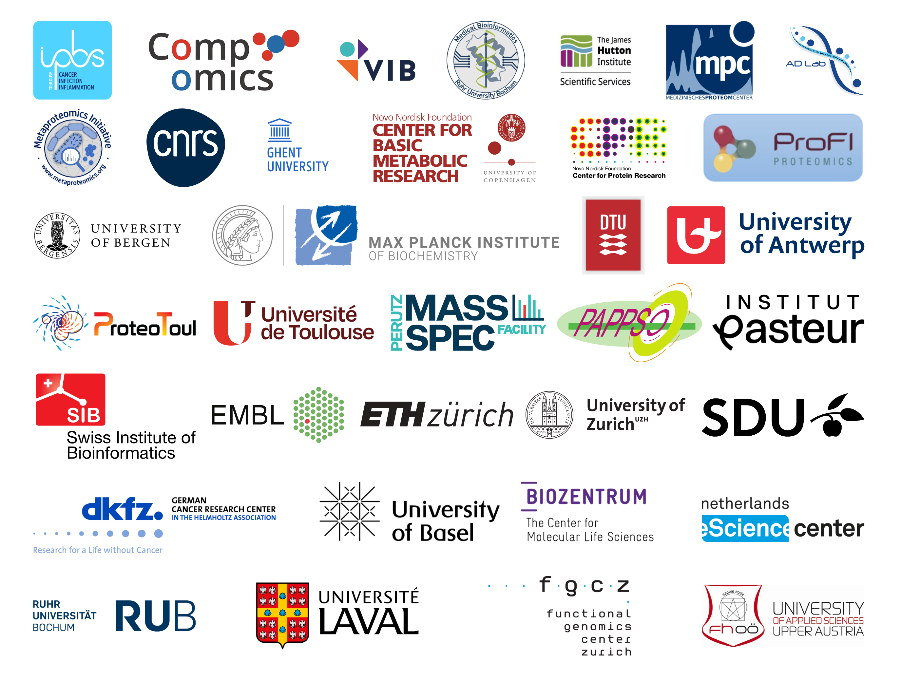

:html_theme.sidebar_secondary.remove:
:sd_hide_title: true

#####
Home
#####

.. toctree::
    :maxdepth: 1
    :hidden:
    :glob:

    Home <self>
    Learn more <general-information/index.rst>
    Benchmarking modules <available-modules/index.rst>
    Developer guide <developer-guide/index.rst>
    Contributing <contributing.rst>

.. div:: landing-title
    :style: padding: 2rem 2rem 4rem 2rem; background: rgb(49, 65, 89); clip-path: polygon(0px 0px, 100% 0%, 100% 100%, 0% calc(100% - 3rem)); -webkit-clip-path: polygon(0px 0px, 100% 0%, 100% 100%, 0% calc(100% - 3rem));

    .. grid::
        :reverse:
        :gutter: 2 3 3 3
        :margin: 4 4 1 2

        .. grid-item::
            :columns: 12 5 5 5

            .. image:: ./_static/img/proteobench-header-hex-dark.svg
                :class: sd-m-auto sd-animate-grow50-rot20

        .. grid-item::
            :columns: 12 7 7 7
            :child-align: justify
            :class: sd-text-white sd-fs-3

            ProteoBench is an open platform for benchmarking proteomics data analysis workflows.

            .. button-link:: #proteobench-in-5-steps
                :outline:
                :color: white
                :class: sd-px-4 sd-fs-5

                Get Started

ProteoBench in 5 steps
=======================

.. image:: ./_static/img/proteobench-steps.png
    :class: sd-m-auto

1. **Choose a module** to benchmark your proteomics data analysis workflow
2. **Download the input data** from the module page
3. **Run your workflow** on the input data
4. **Upload the results** to ProteoBench
5. **Compare your workflow run** with validated benchmark runs

.. button-link:: https://proteobench.cubimed.rub.de/
    :class: sd-px-4
    :color: primary

    ProteoBench Web App :fas:`external-link-alt`

Available ProteoBench modules
==============================

.. For card colors, use:
.. proposed: info
.. in development: primary
.. active: success
.. archived: warning
.. withdrawn: danger

.. grid::

    .. grid-item-card:: DDA quantification ion-level
        :columns: 6 6 4 4
        :padding: 1
        :link: https://proteobench.cubimed.rub.de/DDA%20Quant%20Ion%20Level%20-BETA-

        :bdg-success:`active`
        ^^^
        Benchmark the ion-level quantification accuracy of label-free data dependent acquisition
        workflows using a multi-species sample

    .. grid-item-card:: DDA identification
        :columns: 6 6 4 4
        :padding: 1
        :link: https://github.com/orgs/Proteobench/discussions/373

        :bdg-primary:`in development`
        ^^^
        Benchmark the identification sensitivity and specificity of data dependent acquisition
        workflows using an entrapment strategy

    .. grid-item-card:: DDA quantification peptidoform-level
        :columns: 6 6 4 4
        :padding: 1
        :link: https://github.com/proteobench/proteobench/discussions/202

        :bdg-primary:`in development`
        ^^^
        Benchmark the peptidoform-level quantification accuracy of label-free data dependent
        acquisition workflows using a multi-species sample

    .. grid-item-card:: DIA quantification
        :columns: 6 6 4 4
        :padding: 1
        :link: https://proteobench.cubimed.rub.de/DIA%20Quant%20Ion%20Level%20-BETA-

        :bdg-success:`active`
        ^^^
        Benchmark the quantification accuracy of label-free data independent acquisition workflows
        using a multi-species sample

    .. grid-item-card:: De novo identification
        :columns: 6 6 4 4
        :padding: 1
        :link: https://github.com/orgs/Proteobench/discussions/356

        :bdg-info:`proposed`
        ^^^
        Benchmark the identification sensitivity and specificity of de novo sequencing workflows

    .. grid-item-card:: benchmark with Dynamic Organellar Mapping
        :columns: 6 6 4 4
        :padding: 1
        :link: https://github.com/orgs/Proteobench/discussions/404

        :bdg-info:`proposed`
        ^^^
        Single-species benchmark using spacial proteomics

    .. grid-item-card:: DIA quantification DIA-PASEF
        :columns: 6 6 4 4
        :padding: 1
        :link: https://github.com/orgs/Proteobench/discussions/438

        :bdg-info:`proposed`
        ^^^
        additional DIA ion-level module with DIA-PASEF data

    .. grid-item-card:: single-cell label free DIA quantification
        :columns: 6 6 4 4
        :padding: 1
        :link: https://github.com/orgs/Proteobench/discussions/426

        :bdg-info:`proposed`
        ^^^
        benchmarking identification and quantification workflows for low-input and single cell proteomics (SCP)

.. button-ref:: available-modules/index
    :ref-type: doc
    :class: sd-px-4
    :color: primary

    Module descriptions

Join the ProteoBench community
===============================

.. grid::

    .. grid-item-card::
        :columns: 12 4 4 4
        :img-top: ./_static/img/icons/workflow-run-validated-with-padding.svg
        :img-alt: A check-marked shield in an encircled gear
        :class-card: sd-border-0
        :class-footer: sd-border-0
        :shadow: none
        :text-align: center

        Submit your results as a validated benchmark run to be shared with the community.
        +++
        .. button-link:: https://proteobench.cubimed.rub.de/
            :color: primary
            :expand:

            :fas:`upload` Upload your results

    .. grid-item-card::
        :columns: 12 4 4 4
        :img-top: ./_static/img/icons/discussion-with-padding.svg
        :img-alt: Two speech bubbles
        :class-card: sd-border-0
        :class-footer: sd-border-0
        :shadow: none
        :text-align: center

        Discuss modules, benchmarking runs, and comparisons with the community.
        +++
        .. button-link:: https://github.com/orgs/Proteobench/discussions/
            :color: primary
            :expand:

            :fas:`comments` Discussion forum

    .. grid-item-card::
        :columns: 12 4 4 4
        :img-top: ./_static/img/icons/contribute-with-padding.svg
        :img-alt: A user with a development symbol (</>)
        :class-card: sd-border-0
        :class-footer: sd-border-0
        :shadow: none
        :text-align: center

        Contribute to ProteoBench by developing new modules or improving existing ones.
        +++
        .. button-link:: https://github.com/Proteobench/ProteoBench
            :color: primary
            :expand:

            :fab:`github` GitHub repository

ProteoBench is
===============

A project of
-------------

.. figure:: ./_static/img/eubic-ms-logo.png
    :alt: European Bioinformatics Community for Mass Spectrometry (EuBIC-MS)
    :width: 200px
    :align: left
    :target: https://eubic-ms.org

The European Bioinformatics Community for Mass Spectrometry (EuBIC-MS) is a community of
bioinformaticians working in the field of mass spectrometry-based. EuBIC-MS aims to foster
communication and collaboration between (computational) mass spectrometry researchers in Europe and
beyond. Learn more at `eubic-ms.org <https://eubic-ms.org>`_.

Funded by
----------

.. figure:: ./_static/img/proteobench-funding.png
    :alt: European Proteomics Assocation (EuPA), Danish Data Science Academy (DDSA), and Research Foundation - Flanders (FWO)
    :align: left

Through EuBIC-MS, ProteoBench is continuously supported by the European Proteomics Association
(EuPA). For specific events, such as the ProteoBench hackathon, ProteoBench has received funding
from the Danish Data Science Academy (DDSA), the Research Foundation - Flanders (FWO), and Core For Life.

Supported by
-------------

Get in touch
=============

Questions or comments? Email us at `proteobench@eubic-ms.org <mailto:proteobench@eubic-ms.org>`_.
