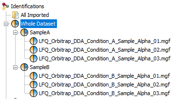

# LFQ, precursor ion (Astral)

{bdg-info}`beta` {bdg-primary-line}`Quantification` — DDA, Orbitrap Astral, precursor-ion level

Compares label-free quantification (LFQ) accuracy and sensitivity for workflows run on
data-dependent acquisition (DDA) data from an Orbitrap Astral (Thermo Fisher).

## At a glance

| | |
|---|---|
| Acquisition | DDA |
| Instrument | Orbitrap Astral |
| Level | Precursor ion (modified sequence + charge) |
| Metric | Epsilon (quantification accuracy) |

## What this module tests

This module is best suited to evaluate the impact of, among others:

- search engine identification
- peak picking
- match-between-runs
- low-level ion signal normalization

It is **not** designed to evaluate later-stage post-processing of quantitative data (e.g. missing
value replacement or manual filtering); please upload data without that kind of post-processing.
Other modules focus specifically on those steps.

## Dataset

A not-yet-released Astral DDA dataset using the same sample composition (conditions "A" and "B") as
described in [Van Puyvelde et al., 2022](https://www.nature.com/articles/s41597-022-01216-6): a
mixture of commercial peptide digest standards of *Escherichia coli*, yeast, and human, at
logarithmic fold changes (log2FC) of 0, −1, and 2 respectively.

Peptides were loaded directly onto a 50 cm μPAC™ analytical column and separated by a
reversed-phase gradient (96% to 60% buffer A over ~16 min, 750 nL/min then 250 nL/min). The mass
spectrometer ran in positive-ionization DDA mode, full MS over m/z 380–980 at 180,000 resolution
(Orbitrap), 2-Th precursor isolation, 30% normalized collision energy (HCD), MS2 over m/z 145–1450
(Astral), 2.5 ms maximum fill time, 10 s dynamic exclusion.

**Download:**
- [All raw files + FASTA (single archive)](https://proteobench.cubimed.rub.de/raws/DDA-astral/all_data_LFQ_Quant_DDA_Astral.tar.gz)
- Individual raw files (`REP1`–`REP3`, conditions A/B) from the
  [ProteoBench server](https://proteobench.cubimed.rub.de/raws/DDA-astral/)
- [FASTA (HYE mixed species + contaminants)](https://proteobench.cubimed.rub.de/fasta/ProteoBenchFASTA_MixedSpecies_HYE.zip),
  contaminants from [Frankenfield et al., JPR](https://pubs.acs.org/doi/10.1021/acs.jproteome.2c00145)

```{important}
Do not rename the downloaded raw files.
```

## How the metric is calculated

For each precursor ion, ProteoBench sums the signal per raw file, removes contaminants (flagged
`Cont_` in the FASTA) and precursors matching multiple species, log2-transforms the remaining
values, then computes the mean and coefficient of variation (CV) per condition. The difference
between the mean log2 intensity in A and B is compared against the expected log2 fold change for
that precursor's species (human: 0, yeast: 1, *E. coli*: −2) — that difference is **epsilon**.

The main plot shows the number of unique precursor ions quantified (vertical axis) against the
mean or median absolute epsilon (horizontal axis). Each tool's section below describes any
tool-specific handling before this point.

## Run your workflow

Run your analysis on the downloaded files with the tool of your choice, then follow
[Your First Submission](../../your-first-submission/index.md) to upload, inspect, and (if you'd
like) submit your results publicly. The [web app](https://proteobench.cubimed.rub.de/Quant_LFQ_DDA_ion_Astral)
is where you upload results and, later, submit them for public review.

## Tool-specific setup

**Table: input files required for metric calculation and public submission**

| Tool | Input file | Parameter file |
|---|---|---|
| AlphaPept | `*.csv` | `results.yaml` |
| Custom | `*.tsv` | — |
| DIA-NN | `report.tsv` or `report.parquet` | `report.log.txt` |
| FragPipe | `combined_ion.tsv` | `fragpipe.workflow` |
| MSAngel | `*.xlsx` | `*.json` |
| MaxQuant | `evidence.txt` | `mqpar.xml` |
| MetaMorpheus | `AllQuantifiedPeaks.tsv` | `search_task_config.toml` + `version_result.txt` |
| PEAKS | `lfq.features.csv` | `*.txt` |
| ProlineStudio | `*.xlsx` | `*.xlsx` |
| Sage | `*.sage.tsv` | `*.json` |
| WOMBAT | `*.csv` | `config.yaml` |
| i2MassChroQ | `*.tsv` | `*.tsv` |
| quantms | `*.csv` | `*.json` |

Expand a tool below for setup details.

:::{dropdown} AlphaPept (legacy tool)
AlphaPept is labelled a legacy tool since it hasn't been actively developed for over a year, and
may underperform relative to more recent versions of other tools.

1. Load the folder containing the data files.
2. Set parameters; for **Match Between Runs**, select "Match".
3. Upload `result_peptides.tsv` (identifications) and `results.yaml` (parameters).

ProteoBench reads `shortname` (raw file name), `protein` (accessions and species), `sequence`,
`charge`, `decoy` (`"true"` filtered out), and `ms1_int_sum_apex_dn` (intensity).
:::

:::{dropdown} FragPipe
1. Select the LFQ-MBR workflow (single enzyme only).
2. After importing raw files, assign experiments "by File Name".
3. **Do not add contaminants when adding decoys to the database.**
4. Upload `combined_ion.tsv` for scoring, and `fragpipe.workflow` as the parameter file.

ProteoBench reads `Modified Sequence`, `Charge`, and `Protein` — concatenated with `Mapped Proteins`
— from `combined_ion.tsv`; decoys are assumed already removed.
:::

:::{dropdown} i2MassChroQ
A ProteoBench-compatible export is built in: after identification, choose "MassChroQ" for
quantification, load the results into MCQR, and use its "ProteoBench export" button. This produces
`proteobench_export.tsv` (columns: `rawfile`, `sequence`, `ProForma`, `charge`, `proteins`, `area`)
and `Project parameters.tsv` for public submission. Protein identifiers should look like
`sp|P49327|FAS_HUMAN`; decoys are assumed already removed.

See the [i2MassChroQ documentation](http://pappso.inrae.fr/bioinfo/i2masschroq/documentation/html/).

If you search with X!Tandem, its default "quick acetyl" and "quick pyrolidone" options search for
N-terminal acetylation and pyroglutamate as variable modifications; turn these off if you don't want
them included.
:::

:::{dropdown} MaxQuant
By default MaxQuant uses its own contaminants-only FASTA. This module's FASTA already includes a
curated contaminant set, so in MaxQuant (Global parameters → Sequences), **untick "Include
contaminants"**. When uploading raw files, use "No Fractions" and name experiments
`A_Sample_Alpha_01`…`A_Sample_Alpha_03`, `B_Sample_Alpha_01`…`B_Sample_Alpha_03`.

Upload `evidence.txt` (in the `txt` output folder) for scoring, and `mqpar.xml` for public
submission. ProteoBench reads `Modified sequence`, `Proteins`, `Raw file`, and `Charge`; decoys are
assumed already removed.

**Troubleshooting — FASTA header parsing**: the `Proteins` column must report proteins as
`sp|O75822|EIF3J_HUMAN` (`;`-separated for groups). Recent MaxQuant defaults
(`Identifier rule = >([^ ]*)`, `Description rule = >(.*)`) work correctly; some older versions don't
expose this setting and aren't compatible.
:::

:::{dropdown} MetaMorpheus (work in progress)
1. Run a Search Task on the input data (don't rename files), using the FASTA provided.
2. Enable LFQ quantification (FlashLFQ) — on by default in the GUI, or set
   `DoQuantification = true` in the CLI `.toml`.
3. Upload `AllQuantifiedPeaks.tsv` from the task-specific output folder.
4. For public submission, upload **two** parameter files: the task's
   `Task<name>SearchTaskconfig.toml` (not the CLI config) and `allResults.txt` (used to parse the
   MetaMorpheus version). Order doesn't matter; an error shown after the first file disappears once
   the second is added.
:::

:::{dropdown} Proline Studio
Name peaklists with the same prefix as the raw files (via peaklist naming or auto-rename).



Use the Excel export. The `Quantified peptide ions` tab must contain `samesets_accessions` and
`subsets_accessions` (combined to determine species per sequence); quantities come from XICs.
Duplicated shared-peptide rows across ProteinSets are combined before scoring. Decoys are assumed
already removed. Quantitative columns look like
`abundance_LFQ_Astral_DDA_15min_50ng_Condition_A_REP1.mgf`.

For public submission, upload the same Excel export with the `Search settings and infos`,
`Import and filters`, and `Quant config` tabs present. Make sure no personal information is in the
file. The ProlineStudio version is only exported in parameters from v2.3 onward.
:::

:::{dropdown} MSAngel (work in progress)
MSAngel builds bottom-up MS pipelines combining a search engine, validation strategy, and Proline
quantification. See the [MS Angel site](https://www.profiproteomics.fr/ms-angel/) for details.
:::

:::{dropdown} PEAKS (work in progress)
Sample names can stay as PEAKS assigns them, as long as Samples 1–3 map to Condition "A" and
Samples 4–6 to Condition "B".

Set Enzyme = trypsin, Instrument = Orbitrap (Orbi-Orbi), Fragment = HCD, Acquisition = DDA. In the
workflow, use PEAKS Q (de novo assisted search quantification); set "Label Free" in the
Quantification tab (individually or grouped by condition); set both Peptide and Protein Group FDR to
1% in the Report tab. Once the workflow finishes, check "All Search Parameters" and the "Feature
Vector CSV" under Label Free Quantification Exports in the Export tab.
:::

:::{dropdown} Sage
1. Convert `.raw` files to `.mzML` with MSConvert or ThermoRawFileParser (don't rename files).
2. Run Sage with a `.json` config.
3. Upload `lfq.tsv` for scoring and `results.json` as the parameter file.

Important: for ion-level modules like this one, do **not** set `combine_charge_states: true`.
ProteoBench reads `proteins`, `peptide`, and `charge` from `lfq.tsv`.
:::

:::{dropdown} quantms (work in progress)
Upload the `ProteomicsLFQ` (OpenMS) output named `<project-name>.sdrf_openms_design_msstats_in.csv`.
Parameters for public submission are parsed from `versions.yml` and the `pipeline-info` step's
`params_<timestamp>.json`. Several PTM-containing variants still need testing.
:::

:::{dropdown} Custom format
If your tool isn't listed above, upload a tab-delimited table with:

- `Sequence` — unmodified peptide sequence
- `Proteins` — `;`-separated identifiers, including the species flag (e.g. `_YEAST`)
- `Charge` — precursor charge
- `Modified sequence` — sequence with localized modifications, ideally
  [ProForma](https://www.psidev.info/proforma)
- one quantitative column per sample:
  `LFQ_Astral_DDA_15min_50ng_Condition_A_REP1` … `LFQ_Astral_DDA_15min_50ng_Condition_B_REP3`

The table must not contain non-validated precursor ions.
:::

### How ProteoBench maps each tool's columns

Each tool's output format is described in a `.toml` file under
`proteobench/io/parsing/io_parse_settings/` in the codebase, defining `[mapper]` (column-name
mapping to ProteoBench's internal names), `[condition_mapper]` and `[run_mapper]` (raw file to
condition/sample), `[species_mapper]` (protein-ID suffix to species), `[general]` (contaminant and
decoy flags, `Cont_` for this module), and `[modifications_parser]` where a combined
sequence-with-modifications column needs parsing.

## Result columns

After upload, the results table includes: the precursor ion (modified sequence + charge); mean and
standard deviation of log2-transformed and of raw intensity per condition; CV per condition; the
difference of mean log2 values between conditions; per-raw-file intensity; the number of raw files
with a non-missing value; species and whether the sequence is species-specific; the expected ratio
for that species; and epsilon.

Use the slider to set the minimum number of raw files a precursor must be quantified in to be
included in the plot (e.g. selecting 3 keeps only precursors seen in ≥3 raw files).

## Parameters tracked for public submission

Upload your parameter file in the drag-and-drop area under "Download calculated ratios"; see
[Tool-specific setup](#tool-specific-setup) above for which file that is per tool. ProteoBench
tracks:

- software tool name and version; search engine name and version, if different
- FDR threshold (PSM, peptide, protein level)
- match-between-runs (on/off)
- precursor and fragment mass tolerance
- enzyme (Trypsin, for this dataset) and maximum missed cleavages
- minimum/maximum peptide length
- fixed and variable modifications, and the maximum number of modifications
- minimum/maximum precursor charge

If any of these are missing from your parameter file, add them in the `Comments for submission`
field.

Once submitted you'll get a pull-request link; save it to track your submission (see
[what happens next](../../your-first-submission/index.md#6-submit-for-public-review)).
[Contact us](mailto:proteobench@eubic-ms.org?subject=ProteoBench_query) or
[open an issue](https://github.com/Proteobench/ProteoBench/issues/new) with any problems.
