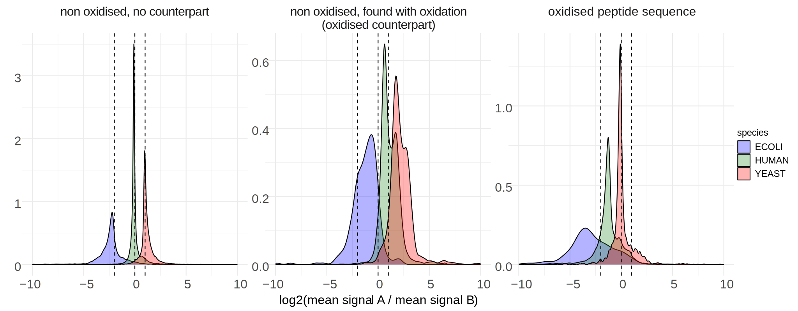

# LFQ, precursor ion (AIF)

{bdg-dark}`archived` {bdg-primary-line}`Quantification` — DIA, Q Exactive HF-X, All-Ion Fragmentation

```{admonition} This module is archived
:class: warning
Archived because of oxidations that prevent accurate measurement of quantification accuracy — see
the original [GitHub discussion](https://github.com/orgs/Proteobench/discussions/641). Oxidized
peptides produce a human-ratio distribution close to the *E. coli* expected ratio (see figure
below). Superseded by the [diaPASEF](dia-ion-diapasef.md), [Astral](dia-ion-astral.md), and
[ZenoTOF](dia-ion-zenotof.md) modules; kept here for reference.
```



All raw files (including samples Beta and Gamma) were searched with Spectronaut v19.5.241126.62635
using a directDIA+ workflow, Trypsin/P cleavage, carbamidomethyl (C) as a fixed modification, and
acetyl (protein N-term) and oxidation (M) as variable modifications (maximum 5 variable
modifications). Run-wise median centering was applied after log2 transformation, then mean per
sample and per condition, and the A-vs-B difference per precursor was calculated. The three panels
show: precursors with ≥1 oxidation (right); precursors sharing the stripped sequence of an oxidized
one (middle); and all other same-species precursors (left).

## At a glance

| | |
|---|---|
| Acquisition | DIA (All-Ion Fragmentation) |
| Instrument | Q Exactive HF-X Orbitrap |
| Level | Precursor ion (modified sequence + charge) |
| Metric | Epsilon (quantification accuracy) |

## What this module tests

This module compared sensitivity and quantification accuracy for DIA data acquired with All-Ion
Fragmentation (AIF) on a Q Exactive HF-X. It was best suited to evaluate the impact of search engine
identification, peak picking, and low-level ion signal normalization, and was **not** designed to
evaluate later-stage post-processing (missing value replacement, manual filtering).

## Dataset

A subset of the Q Exactive HF-X AIF data described in
[Van Puyvelde et al., 2022](https://www.nature.com/articles/s41597-022-01216-6): the first
biological replicate series ("alpha"), three technical replicates of two conditions. Samples are
commercial peptide digest standards of *Escherichia coli*, yeast, and human, at logarithmic fold
changes (log2FC) of 0, −1, and 2 respectively.

**Download:**
- [ProteomeXchange PXD028735](https://www.ebi.ac.uk/pride/archive/projects/PXD028735)
- Or from the [ProteoBench server](https://proteobench.cubimed.rub.de/raws/DIA/) /
  [single archive](https://proteobench.cubimed.rub.de/raws/DIA/all_data_LFQ_Quant_DIA_AIF.tar.gz)
- [FASTA (HYE mixed species + contaminants)](https://proteobench.cubimed.rub.de/fasta/ProteoBenchFASTA_MixedSpecies_HYE.zip),
  contaminants from [Frankenfield et al., JPR](https://pubs.acs.org/doi/10.1021/acs.jproteome.2c00145)

## How the metric was calculated

For each precursor ion, ProteoBench summed the signal per raw file, removed contaminants (flagged
`Cont_`) and multi-species precursors, log2-transformed the remaining values, and computed the mean
and CV per condition. The difference between mean log2 intensity in A and B was compared against the
expected log2 fold change per species — that difference is epsilon.

**Table: suggested parameters used for this dataset**

| Parameter | Value |
|---|---|
| Maximum missed cleavages | 1 |
| PSM FDR | 0.01 |
| Spectral library | Predicted from FASTA |
| Precursor charge state | 1–4 |
| Precursor m/z range | 400–1000 |
| Fragment ion m/z range | 50–2000 |
| Endopeptidase | Trypsin/P |
| Fixed modifications | Carbamidomethylation (C) |
| Variable modifications | Oxidation (M), Acetyl (Protein N-term) |
| Maximum variable modifications | 1 |
| Minimum peptide length | 6 residues |

## Tool-specific setup (historical reference)

**Table: input files used for metric calculation and public submission**

| Tool | Input file | Parameter file |
|---|---|---|
| AlphaDIA | `precursors.tsv` | `log.txt` |
| DIA-NN | `*_report.tsv` | `*report.log.txt` |
| FragPipe | `*_report.tsv` | `fragpipe.workflow` |
| MaxDIA | `evidence.txt` | `mqpar.xml` |
| Spectronaut | `*.tsv` | `*.txt` |
| PEAKS | `lfq.dia.peptides.csv` | `parameters.txt` |

:::{dropdown} DIA-NN
1. Import raw files.
2. Add the FASTA, but do not select "Contaminants" (already included).
3. Turn on FASTA digest for library-free search / library generation.
4. Do not set verbosity/log level above 1, or parameter parsing will fail.
5. Upload `*_report.tsv` or `*_report.parquet` for scoring and `report.log.txt` for public
   submission.
:::

:::{dropdown} AlphaDIA
1. Select the FASTA and import `.raw` files in "Input files".
2. Define search parameters in "Method settings".
3. Turn on "Predict Library" and "Precursor Level LFQ".
4. Because ProteoBench required both `precursors.tsv` and `precursor.matrix.tsv`, preprocessing via
   the [conversion notebook](https://github.com/Proteobench/ProteoBench/blob/main/jupyter_notebooks/ProteoBench_input_conversion.ipynb)
   was needed. The parameter file is `log.txt`.
:::

:::{dropdown} FragPipe (DIA-NN quant)
1. Load the DIA_SpecLib_Quant workflow.
2. After importing raw files, assign experiments "by File Name".
3. **Do not add contaminants when adding decoys to the database.**
4. Upload `*report.tsv` for scoring and `fragpipe.workflow` for public submission.

FragPipe reports protein identifiers across two columns ("Proteins" and "Mapped Proteins"); these
are concatenated to form the protein groups.
:::

:::{dropdown} Spectronaut
Accepted format: BGS Factory Report — `..._Report.tsv` for scoring,
`..._Report.setup.txt` for parameter parsing.

1. Import the module FASTA in "Databases" (UniProt parsing rule).
2. In "Analysis", select "Set up a DirectDIA Analysis from file" and load the raw files.
3. Import the FASTA on the next tab and select it.
4. Choose search settings.
5. Assign conditions: "A" for the three `Condition_A_Sample_Alpha` replicates, "B" for the three
   `Condition_B_Sample_Alpha` replicates.
6. Skip GO terms/library extensions.
7. Run the search, then export a BGS Factory Report as `..._Report.tsv`.
8. Upload `..._Report.tsv` privately and `..._Report.setup.txt` for public submission.
:::

:::{dropdown} MaxDIA (work in progress)
By default MaxDIA uses its own contaminants-only FASTA. This module's FASTA already includes a
curated contaminant set, so **untick "Include contaminants"** (Global parameters → Sequences), and
set FASTA parsing to `Identifier rule = >([^\t]*)`, `Description rule = >(.*)`. Use "No Fractions"
and name experiments `A_Sample_Alpha_01`…`A_Sample_Alpha_03`, `B_Sample_Alpha_01`…`B_Sample_Alpha_03`.

Upload `evidence.txt` for scoring and `mqpar.xml` for public submission.
:::

:::{dropdown} PEAKS
Rename samples to match the raw file names exactly (`LFQ_Orbitrap_AIF_Condition_A_Sample_Alpha_01`
… `_03`, and the equivalent for condition B).

Set Enzyme = trypsin, Instrument = Orbitrap (Orbi-Orbi), Fragment = HCD, Acquisition = DIA. In the
workflow, use the Quantification option; define search parameters in "DB search". In
"Quantification" use "Label Free" (individually or grouped by condition); in "Report" set both
Peptide and Precursor FDR to 1%. Check "All Search Parameters" and the "Feature Vector CSV" (Export
tab) once finished.

**Troubleshooting**: since the Thermo DIA `.raw` files used a staggered-window acquisition, convert
and demultiplex to `.mzML` with MSConvert first — see
[FragPipe's conversion tutorial](https://fragpipe.nesvilab.org/docs/tutorial_convert.html#convert-thermo-dia-raw-files-with-overlappingstaggered-windows).
:::

:::{dropdown} Custom format
The custom tab-delimited format used the following columns:

- `Sequence` — unmodified peptide sequence
- `Proteins` — `;`-separated identifiers, including the species flag (e.g. `_YEAST`)
- `Charge` — precursor charge
- `Modified sequence` — sequence with localized modifications, ideally
  [ProForma](https://www.psidev.info/proforma)
- one quantitative column per sample:
  `LFQ_Orbitrap_AIF_Condition_A_Sample_Alpha_01` … `LFQ_Orbitrap_AIF_Condition_B_Sample_Alpha_03`

The table was not to contain non-validated ions.
:::

## Result columns

The results table included: the precursor ion (modified sequence + charge); mean and standard
deviation of log2-transformed and of raw intensity per condition; CV per condition; the difference
of mean log2 values between conditions; per-raw-file intensity; the number of raw files with a
non-missing value; species and whether the sequence is species-specific; the expected ratio for
that species; and epsilon.

## Parameters tracked for public submission

ProteoBench tracked: software tool name and version; search engine name and version (if different);
FDR threshold (PSM, peptide, protein level); match-between-runs; precursor and fragment m/z range
and mass tolerance; enzyme and maximum missed cleavages; minimum/maximum peptide length; fixed and
variable modifications and their maximum count; and minimum/maximum precursor charge.

[Contact us](mailto:proteobench@eubic-ms.org?subject=ProteoBench_query) or
[open an issue](https://github.com/Proteobench/ProteoBench/issues/new) with any problems.
